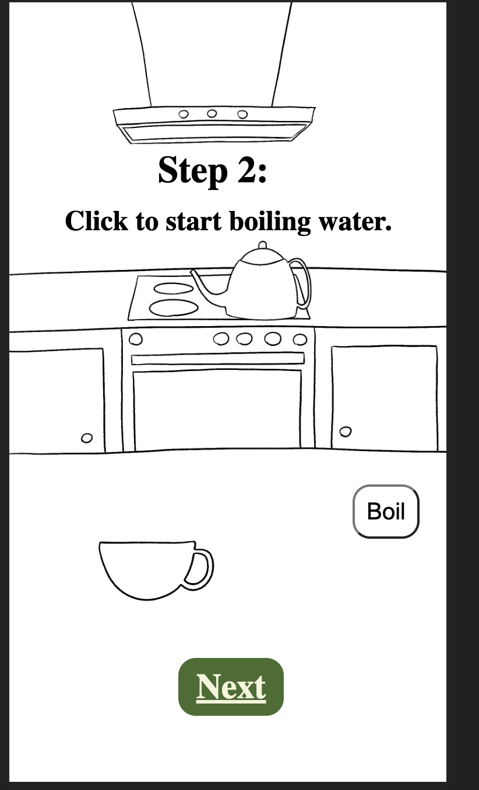
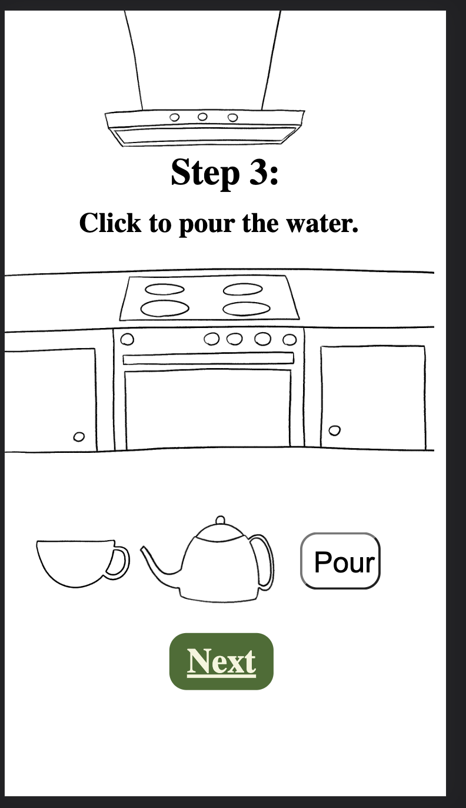
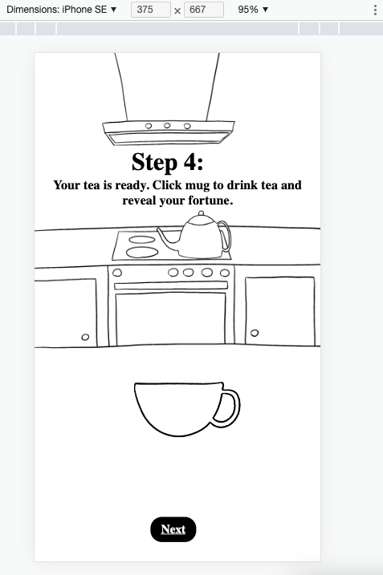
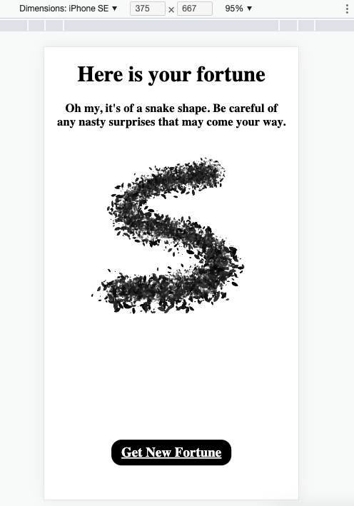
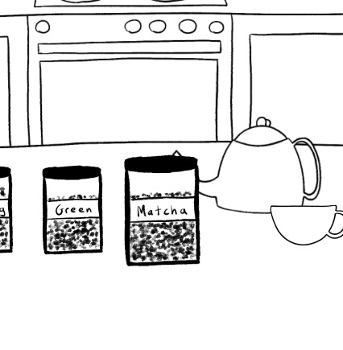
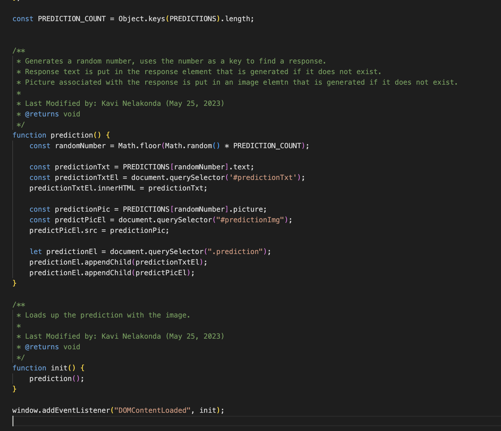

# Team 18 Meeting Minutes for Friday, May 26

## Details

Location: Geisel 1st Floor
Time: Friday, May 26 12:00pm
Meeting Type: Sprint Review Meeting

### Attendance

-   Grant
-   Brian
-   Pramesh
-   Kavi
-   Shuyi
-   Damaris
-   Yulei
-   Jessie
-   Emily
-   Fangyu

### Agenda / Tasks

-   Sprint Review Meeting

## Minutes

### The Plan

-   Will do Sprint Review Meeting first, then retrospective
-   Will then create the video
    -   Video doesn't even need to be the

### Sprint Review Meeting

#### Everyone's Updates

-   Pramesh
    -   Work Done
        -   Set up multiple ADRs
        -   Finished the roadmap
        -   Working on unit testing
    -   Will Do
        -   Looking into CI/CD more
        -   Finish the diagram tonight
        -   Will write the paper and help create the video
    -   Blockers
        -   Looking for an ideal way to setup the CI/CD pipeline
-   Jessie
    -   Work Done
        -   Responsiveness
        -   Worked on frames 1 and 2 and is done
        -   Styling HTML and CSS to show the teacup and to show the tea draining animation
    -   Will Do
        -   Need to do 4 and 5
-   Fangyu
    -   Work Done
        -   Worked with Damaris on HTML and CSS on the arrangement (similar to the design that we had before on frame 1, 2, 3 and 4)
        -   Finished the basic elements
        -   Also finished layout arrangements
    -   Will Do
        -   Work on doing what Brian said on minor changes
        -   Confirm button for frame 1
        -   Learn about adjustments (responsiveness to screen size)
        -   Will need to work on responsiveness on Desktop
-   Kavi
    -   Work Done
        -   Finished the predictions
    -   Will Do
        -   Need to work on storing things in cache/cookies
    -   Blocks
        -   Reloading the page again will randomize the prediction
-   Shuyi
    -   Work Done
        -   Talked with other teammates about frontend code
        -   Will be responsible to frame 3 and 4 on CSS and JS
        -   Have done frame 3 already
    -   Will Do
        -   Will work on frame 4
        -   Will also switch out the background
        -   Will work on it tomorrow (Saturday)
-   Brian
    -   Work Done
        -   Setup milestones
        -   Drew assets
        -   Changelogs
    -   Will Do
        -   Work on generating audio assets
        -   Need to get more assets
        -   Will try to generate all tickets/issues for next week to keep it consistent
        -   Will put in project, milestones, and stuff
        -   Will work on Desktop
        -   Will make the demo on Tuesday night for the video
-   Damaris
    -   Work Done
        -   Finished setting the HTML files for mobile
        -   Setup separate queries for mobile and desktop versions
    -   Will Do
        -   Change positioning based on the query
        -   Remove the pour and boil buttons so people can interact with the objects
-   Grant
    -   Work Done
        -   Drew assets for the dredges and backgrounds and objects
        -   Set up the CI pipeline for ESLint and CodeQL
        -   Set up Codacy and added quality badge to the README
        -   Worked on adding JSDoc
    -   Will Do
        -   Need to finalize adding JSDocs
-   Emily
    -   Work Done
        -   Added documentation and comments for HTML files and formatting
    -   Will Do
        -   Finish adding documentation for CSS
-   Yulei
    -   Work Done
        -   Did a lot of work on the E2E and Unit testing using lab 8 as a guideline
        -   Research into CI/CD pipeline
    -   Will Do
        -   Integrate testing with current code as soon as that gets pushed to dev

#### Screenshots and Demos

-   Frame 1
    -   
-   Frame 2
    -   
-   Frame 3
    -   
-   Frame 4
    -   
-   Frame 5
    -   
-   Jar Selection (changes sizes upon selection)
    -   
-   Prediction Code: all of the different responses available
    -   

Meeting ended at 1:00pm.
