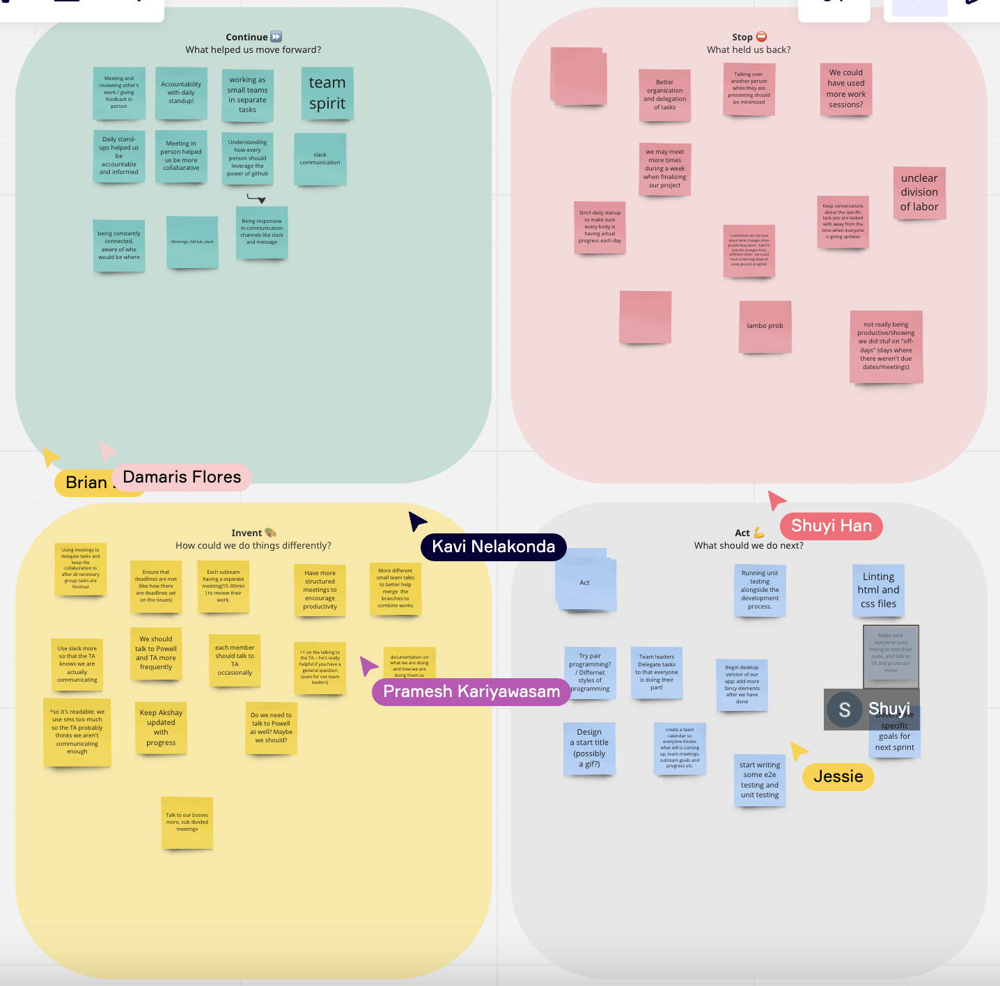

# Team 18 Meeting Minutes for Sunday, May 28

## Details

Location: Zoom
Time: Sunday, May 28 8:15pm
Meeting Type: Sprint 1 Retrospection Meeting

### Attendance

-   Grant
-   Brian
-   Pramesh
-   Shuyi
-   Damaris
-   Yulei
-   Fangyu
-   Emily
-   Kavi
-   Jessie

### Agenda / Tasks

-   Sprint Retrospection Meeting

## Minutes

### The Plan

-   Use a [Miro Board](https://miro.com/welcomeonboard/UkxxODNNdlg1Tm9xYUpUeEVVN0hYU2s0SjVqMFJRd3dQU2JpZ3lsYVAyMkthSFE3czZFenNObk5TcTQ0UWpPMHwzNDU4NzY0NTUzMzAwNjM1MjE1fDI=?share_link_id=104001304364) to brainstorm the retrospection
-   Split the meeting into Continue, Stop, Invent, Act
    -   Continue: what helped us move forward?
    -   Stop: what held us back?
    -   Invent: how could we do things differently?
    -   Act: what should we do next?

### Sprint Retrospection Meeting

-   Continue
    -   Meeting and reviewing other's work / giving feedback in person
    -   Accountability with daily standups
    -   Working as small teams in separate tasks
    -   Daily standups helped us be accountable and informed
    -   Meeting in person helped us be more collaborative
    -   Understanding how every person should leverage the power of Github
    -   Being constantly connected, aware of who would be where
    -   Meetings, Github, Slack
    -   Being responsive in communication channels like slack and message
    -   Team spirit
    -   Slack communication
-   Stop
    -   Better organization and delegationg of tasks
    -   Talking over another person while they are presenting should be minimized
    -   We could have used more work sessions?
    -   Strict daily standup to make sure that everybody is having actual progress each day
    -   Lambo problem
    -   We may meet more times during a week when finalizing our project
    -   Keep conversations about the specific task you are tasked with away from the time when everyone is giving updates
    -   Unclear division of labor
    -   Not really being productive/showing we did stuff on "off-days" (days where there weren't due dates/meetings)
-   Invent
    -   Using meetings to delegate tasks and keep the collaboration to after all necessary group tasks are finished
    -   Ensure that deadlines are met (like how there are deadlines set on the issues)
    -   Use Slack more so that the TA knows we are actually communicating (we use messaging too much not on Slack, so the TA probably things we aren't communicating enough)
    -   Each subteam having a separate meeting (15-30 minutes) to review their work and sync up
    -   Each member should talk to the TA occasionally
    -   +1 on the talking to the TA - he's really helpful if you have a general question (even for not the team leaders)
    -   Do we need to talk to Powell as well? Maybe we should?
    -   More different small team talks to better help merge the branches to combine works
    -   Have a more structured meetings to encourage productivity
    -   We should talk to Powell and TA more frequently
    -   Keep Akshay updated with progress
    -   Create a team calendar so everyone knows what deadline is coming up, team meetings, subteam goals and progerss, etc.
    -   Talk to our bosses more, sub divided meetings
    -   Documentation on what we are doing and how we are doing them so everyone knows how things are done
-   Act
    -   Begin desktop version of our app; add more fancy elements after we have done
    -   Determine specific goals for next sprint
    -   Linting HTML/CSS files
    -   Try pair programming / different styles of programming
    -   Design a start title (possibly a gif)
    -   Create a team calendar
    -   Start writing some e2e testing and unit testing
    -   Make sure everyone uses litning to test their code, talk to the TA/Professor more
    -   Running unit testing alongside the development process
    -   Team leaders delegate tasks so thate everyone is doing their part

### Consensus and Summary

-   Can definitely have more accountability
-   Embrace using the Github Project more
    -   Brian will make very specific tickets and assign it to people
    -   Pramesh can add to roadmap after creating tickets
-   This week will be structured and delegated better

### Others

-   Mobile app done by Monday night, demo/status video by Tuesday
-   Everyone make sure to lint!
-   Added branch protection to require a reviewer to approve a PR
-   When we have a deploy link working, Akshay wants an update, so make sure to get that done ASAP

### Miroboard

Meeting ended at 9:10pm.
